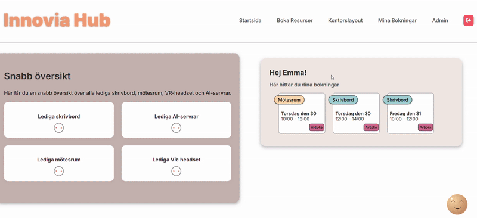

# InnoviaHub

InnoviaHub helps organizations efficiently manage and book shared office resources through an intuitive web interface.

### Demo



#### InnoviaHub is live at [InnoviaHub live](https://purple-dune-09709a403.3.azurestaticapps.net/) only from 29/10-25 until around 14/11-25

### Quick Start
---

1. Clone the repo  
2. Configure your `.env` file  
3. Run the backend (`dotnet run`)  
4. Start the frontend (`npm run dev`)  
5. Open [http://localhost:5173](http://localhost:5173)


## Contributors
This project was originally developed as a group effort by:
- [Isabel Demirel](https://github.com/pixabel)
- [Robin Brink](https://github.com/Brinkentosh)
- [Emma Högdal](https://github.com/Dilemma98)

The `main` branch reflects the group project.

The `mainV2` branch is an individual continuation and further development by [Emma Högdal](https://github.com/Dilemma98).


## Features
#### 👥 Developed as group
- **User Registration & Authentication**: Secure sign-up and login with JWT tokens.
  > User login to test: 
  
  - **Email** : user@test.com
  - **Password** : Test123!
- **Admin Controls**: Manage users and resources via dedicated admin endpoints.  
  > Admin login credentials are provided separately to the course instructor.
- **Resource Booking**: Users can book and manage available office resources via the dashboard.
- **Responsive UI**: Built with React and styled with CSS modules.

### Added features 
---
#### 🙋‍♀️ Developed individually by me, Emma Högdal
- **AI-implementation**

  This feature helps users avoid personal double-bookings by using AI to check their existing bookings before confirming a new one.


- **IoT-sensors**
  
  This feature allows administrators to view and analyze data from sensors installed throughout the office.
  
  This feature was developed in a separate repository. See the forked [IoT Repository](https://github.com/Dilemma98/InnoviaHub-IoT) for details.


## Tech Stack

  ### Backend

  - ASP.NET Core
  - SignalR
  - Sensor API
  - JWT Token

  ### Frontend

  - SignalR
  - React.js
  - Fetch API

  ### Data Management

  - Entity Framework Core
  - SQL Server (Azure)

  ### DevOps & Infrastructure

  - GitHub
  - Trello
  - Azure
  - Swagger for API-documentation

## Setup & Installation

### Prerequisites

- **[.NET SDK 9.0](https://dotnet.microsoft.com/download/dotnet/9.0)**

- **ENV-variables**  
  In the root of your backend folder, create a new file and name it `.env`.  
  Also, make sure to add `.env` to your `.gitignore`.

#### JWT_SECRET

1. Generate a JWT secret key.

   - **Linux / macOS**  
     Open your terminal and run:  
     ```bash
     openssl rand -hex 32
     ```

   - **Windows (PowerShell)**  
     Open PowerShell and run:  
     ```powershell
     [guid]::NewGuid().ToString("N")
     ```

2. This will generate a random key. Place it in your `.env` file like this:

JWT_SECRET = "your_generated_jwt_token"

#### OPEN_AI_KEY
1. Go to [OpenAI’s API Keys page](https://platform.openai.com/account/api-keys).
(You need an OpenAI account to access this page.)

2. Click on **“Create new secret key”** and copy the generated key.  
   > ⚠️ You will only see the key once — make sure to copy and save it securely.

3. Place the key in your `.env` file like this:

OPENAI_API_KEY = "your_generated_openai_api_key"
 > ⚠️ Never commit your API key to version control. Keep it safe and only share it via environment variables or secret managers.


#### AZURE CONNECTION-STRING
> This string is provided separately to the course instructor


------
### Backend Setup

1. **Clone the repository:**

```bash
git clone https://github.com/Dilemma98/InnoviaHub.git

cd InnoviaHub/Backend 
```

2. **Restore Dependencies**

```bash
dotnet restore
```

3. **Build the project:**

```bash
dotnet build
```

4. **Run the application:**

```bash
dotnet run
```

The backend will be accessible at <http://localhost:5271>.

### Frontend Setup

1. **Navigate to the frontend directory:**

```bash
cd ../Frontend
```

2. **Install dependencies:**

```bash
npm install
```

3. **Start the development server:**

```bash
npm run dev
```

The frontend will be accessible at <http://localhost:5173/>.

### API Documentation

Documentation of the API endpoints is available at Swagger UI:

<http://localhost:5271/index.html>
